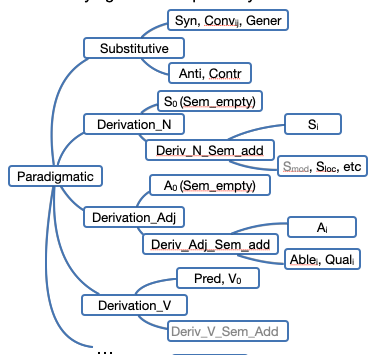
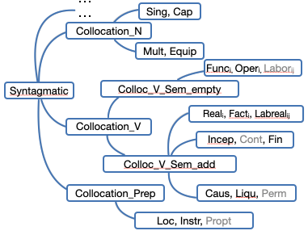
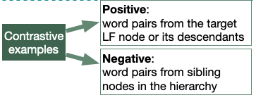

# Assessing LLMs' Understanding of Structural Contrasts in the Lexicon 
This work also serves as a Master’s project entitled
*Évaluation de la compétence lexicale des modèles de langue*.

This repository provides a **benchmark for evaluating the lexical competence of large language models (LLMs)**, grounded in the **Meaning–Text Theory (MTT)** and its system of **Lexical Functions (LFs)**.

The benchmark focuses on assessing whether LLMs can recognize **fine-grained structural contrasts in the lexicon**, going beyond surface-level word similarity to test relational and combinatorial lexical knowledge.
This work was published in the proceedings of **IWCS2025**.


## Overview
While LLMs demonstrate strong fluency and semantic capabilities, their understanding of **structured lexical relations** remains underexplored. This benchmark addresses this gap by evaluating models on their ability to distinguish **paradigmatic and syntagmatic lexical functions** at multiple levels of granularity.

The benchmark is built on a **hierarchical classification of lexical functions** and uses **contrastive prompt-based evaluation** to systematically probe models’ sensitivity to lexical structure.

## Theoretical Framework
The benchmark is grounded in **Meaning–Text Theory (MTT)**, a well-established linguistic framework that places the lexicon and its combinatorial properties at the center of linguistic description.

Within MTT, **Lexical Functions (LFs)** encode recurrent semantic and syntactic relations between lexical units (words in specific senses), such as:
- synonymy and antonymy, like `Syn(film) = movie`
- intensification, like `Magn(awake) = wide [~]`
- support verb constructions, like `Oper2(criticism) = to face [~]`
- etc,.

LFs provide a principled and theory-driven basis for evaluating lexical competence.

## Hierarchical Organization of Lexical Functions

Paradigmatic (left) and syntagmatic (right) lexical functions are organized
into parallel hierarchical structures:




As shown in the images above, nodes closer to the root represent broader, more general distinctions, whereas the terminal (leaf) nodes capture much finer-grained lexical relationships.

## Data Source

The benchmark is constructed from the **French Lexical Network
([LN-fr](https://www.ortolang.fr/market/lexicons/lexical-system-fr/v3.2))**,
a large-scale lexicographic resource developed within the MTT framework.

LN-fr provides:
- ~30k lexical units covering ~19k French lemmas
- Over 66k manually curated instances of lexical functions
- Explicit encoding of paradigmatic and syntagmatic relations

Only LF instances with complete information (LF type, keyword, value) are retained. LF categories with insufficient data are excluded to ensure reliability.

## Task Design

The benchmark adopts a **contrastive binary classification task**, framed as prompt-based question answering.

For each target LF:
- Positive examples are sampled from the target LF
- Negative examples are sampled from *sibling LFs* in the hierarchy, ensuring structurally close contrasts.




Each prompt includes:
- A definition of the target lexical function
- Positive and negative examples
- A query word pair to be evaluated

Models must answer **Yes** or **No** depending on whether the query instantiates the target LF.

Optional linguistic cues can be included in prompts:
- Keyword-in-context (KWIC) snippets
- Propositional forms encoding argument structure
#### Prompt example
```
Oper_1 is a lexical function which, given a lexical unit as a keyword, selects another one as a collocate in order to form a lexical collocation …
Here are some positive examples: 
tiredness -> experience
Propositional form of the keyword: ~ of $1 caused by $2
KWIC context of the keyword: … for me the 【tiredness】 quickly invaded my body and …
Answer: **Yes**
...
Here are some negative examples:
hair -> take care of
Propositional form of the keyword: 
~ of $1
KWIC context of the keyword: 
… the devastated forehead, the 【hair】 flat and thin … 
Answer: **No**
...
** QUESTION **:
football -> play
Propositional form of the keyword: 
~ played by $1
KWIC context of the keyword: 
… the 【football】 World Cup was organized in Sweden …
Does the above word pair also constitute a valid example of this class of lexical function?
```
## What This Benchmark Evaluates

This benchmark is designed to assess:

- Sensitivity to **lexical relations beyond surface similarity**
- Ability to distinguish **structurally close lexical relationships**
- Robustness across **paradigmatic vs. syntagmatic relations**
- Impact of **relation granularity** on model performance
- Reliance on morphological similarity versus structural understanding

## Evaluation Protocol

The benchmark supports:
- Multiple contrastive setups per LF
- k-shot prompting with configurable numbers of examples
- Controlled inclusion of linguistic cues
- Repeated evaluation with different random seeds

Although the current experiments focus on French, the targeted lexical relations are **theoretically universal**, making the benchmark suitable for multilingual extensions.

## Citation

If you use this benchmark, please cite the following paper:
*[Assessing LLMs’ Understanding of Structural Contrasts in the Lexicon](https://aclanthology.org/2025.iwcs-main.9/)*

